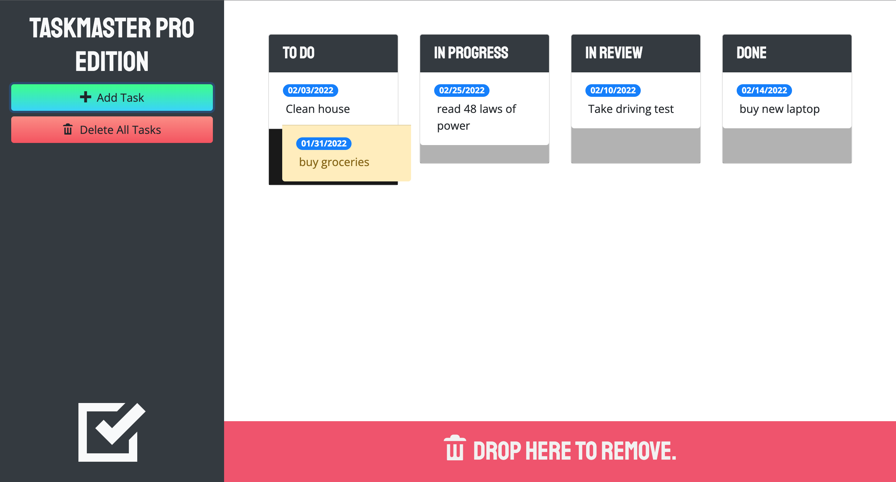

# Taskmaster-Pro
    

## Description 
Application was built to stay in line with your important task that you have a deadline with. Task changes with color as they get closer to deadline or past the deadline.

 ### This project can be found:

- [GitHub Repository](https://github.com/codemasterdev/taskmaster-pro)
- [Live Deployment](https://codemasterdev.github.io/taskmaster-pro/)

## Technologies

> The following were used in this project:

- `HTML`
- `CSS`
- `Bootstrap`
- `Git`
- `GitHub`
- `JavaScript`
- `Moment.js`
- `Jquery/JqueryUI`
- Coded with `VS Code`

## Contribution
Made with ❤️ by [Devon Webster]

## Images

